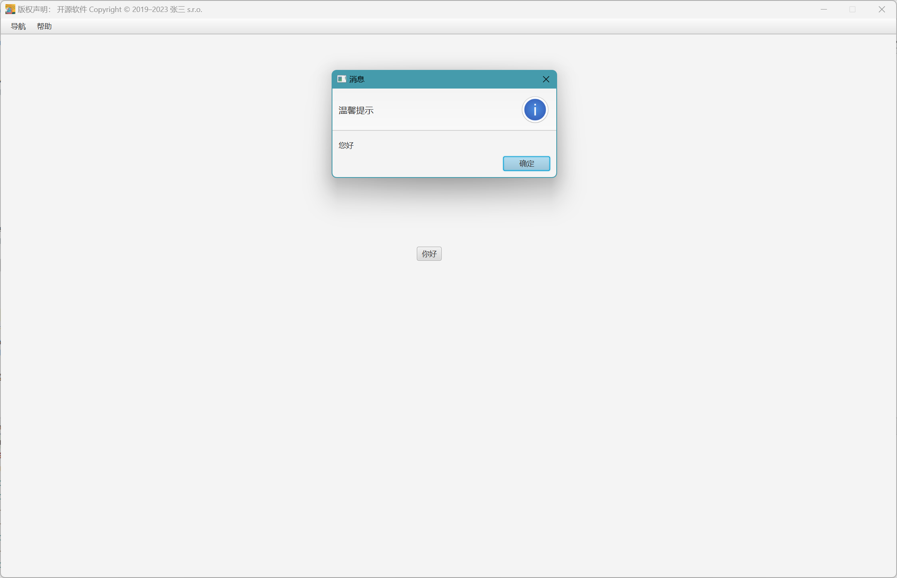

# 1.📚简介

&emsp;&emsp;***micro-javauicore***是一个轻量级开源基于javafx的JAVA-UI框架,以插件方式提供功能扩展方便二次开发.开发标准,方便管理,节约成本.

## 已经实现的样例

1. 菜单模块
2. 最小化
3. 关于模块
4. 语音阅读
5. 配置修改
6. 环境要求,jdk17+idea

## 计划实现

1. 增加菜单部分Ui的单独遮罩+配合其他pane的遮罩
2. 增加配置项,可以直接锁定菜单无法点击,仅可以在启动界面进行操作


# 2.📘安装

pom.xml文件引入dependency节点,如下:

```xml

<dependencies>
    <dependency>
        <groupId>cn.bigcore</groupId>
        <artifactId>micro-javauicore</artifactId>
        <version>1.2-SNAPSHOT</version>
    </dependency>
</dependencies>

```

# 3.使用

增加自定义启动类(需要调用***MainLauncher.main(args)***)/如果直接用该框架进行开发可以直接调用MainLauncher.main方法:

```java

package cn.bigcore.framework;

import starter.core.ui.cn.bigcore.framework.MainLauncher;

import java.io.UnsupportedEncodingException;

/**
 * 主要启动类
 */
public class Launcher {
    public static void main(String[] args) throws UnsupportedEncodingException {
        MainLauncher.main(args);
    }
}

```

# 4.启动

直接运行启动类即可(初次使用会生成java_ui.ini配置文件)

# 5.组件开发说明(创建"你好"测试应用)

## 5.1 测试应用开发

### 5.1.1 创建索引文件(xxx.ui.extend.url.HelloURL.java):

```java

package cn.bigcore.framework.ui.extend.url;

import base.url.core.ui.cn.bigcore.framework.URLInterface;

import java.net.URL;

public class HelloURL implements URLInterface {
    @Override
    public URL getFXML() {
        return null;//前端文件位置
    }

    @Override
    public String getMark() {
        return "你好";//功能说明
    }

    @Override
    public Class getController() {
        return null;//API接口类位置
    }
}


```

### 5.1.2 创建API接口类(xxx.ui.extend.controller.HelloController.java)

创建接口类,并创建弹窗方法 "您好"

```java
package cn.bigcore.framework.ui.extend.ui.extend.controller;

import base.controller.core.ui.cn.bigcore.framework.BaseController;
import utils.controller.core.ui.cn.bigcore.framework.AlertUtils;

import java.io.IOException;
import java.util.Map;

public class HelloController implements BaseController {

    /**
     * 模态窗父-子数据传送
     * 也可用于界面初始化
     *
     * @param map
     */
    @Override
    public void initData(Map<String, Object> map) {

    }

    /**
     * 界面初始化
     *
     * @throws IOException
     */
    public void initialize() throws IOException {

    }

    public void hello() {
        AlertUtils.info("您好");
    }

}


```

### 5.1.3 创建前端文件(resources/ui/extend/hello.fxml)

fx:controller 指定对应的API接口, onMouseClicked="#hello" 指定hello方法

```

<?xml version="1.0" encoding="UTF-8"?>

<?import javafx.scene.control.Button?>
<?import javafx.scene.layout.Pane?>
<Pane maxHeight="-Infinity" maxWidth="-Infinity" minHeight="-Infinity" minWidth="-Infinity" prefHeight="900"
      prefWidth="1440" xmlns="http://javafx.com/javafx/17.0.2-ea" xmlns:fx="http://javafx.com/fxml/1"
      fx:controller="cn.bigcore.framework.ui.extend.controller.HelloController">

    <Button  layoutX="669.0" layoutY="342.0" mnemonicParsing="false" onMouseClicked="#hello" text="你好"/>

</Pane>


```

### 5.1.3 修改索引文件(xxx.ui.extend.url.HelloURL.java)

```java

public class HelloURL implements URLInterface {
    @Override
    public URL getFXML() {
        return ResourceUtil.getResource("ui/extend/hello.fxml");//前端文件位置
    }

    @Override
    public String getMark() {
        return "你好";//功能说明
    }

    @Override
    public Class getController() {
        return HelloController.class;//API接口类位置
    }
}

```

## 5.2 将"您好"应用加入菜单

### 5.2.1 创建索引文件(xxx.ui.extend.url.MenuURL.java):

```java

package cn.bigcore.framework.ui.extend.url;

import base.url.core.ui.cn.bigcore.framework.URLInterface;

import java.net.URL;

public class MenuURL implements URLInterface {
    @Override
    public URL getFXML() {
        return null;//前端文件位置
    }

    @Override
    public String getMark() {
        return "菜单";//功能说明
    }

    @Override
    public Class getController() {
        return null;//API接口类位置
    }
}


```

### 5.2.2 创建API接口类(xxx.ui.extend.controller.MenuController.java)

创建菜单接口类,并加入 "您好" 应用索引方法

```java
package cn.bigcore.framework.ui.extend.controller;

import utils.url.core.ui.cn.bigcore.framework.FXMLBottomUtils;
import cn.bigcore.framework.ui.extend.bean.CompanyNetworkURL;
import cn.bigcore.framework.ui.extend.bean.HelloURL;

import java.io.IOException;

public class MenuController extends controller.core.ui.cn.bigcore.framework.MenuController {


    public void companynetwork() throws IOException {
        FXMLBottomUtils.loadFXML(new CompanyNetworkURL(), this.context_pane);
    }

    public void hello() throws IOException {
        FXMLBottomUtils.loadFXML(new HelloURL(), this.context_pane);
    }
}


```

### 5.1.3 创建前端文件(resources/ui/extend/menu.fxml)

对应的位置加入 "你好" 菜单

```

<?xml version="1.0" encoding="UTF-8"?>

<?import javafx.scene.control.*?>
<?import javafx.scene.layout.Pane?>
<?import javafx.scene.layout.VBox?>
<Pane fx:id="root_pane" prefHeight="900" prefWidth="1440"
      xmlns="http://javafx.com/javafx/17.0.2-ea"
      xmlns:fx="http://javafx.com/fxml/1"
      fx:controller="cn.bigcore.framework.ui.extend.controller.MenuController">
    <VBox>
        <MenuBar>
            <menus>
                <Menu mnemonicParsing="false" text="导航">
                    <items>
                        <MenuItem mnemonicParsing="false" onAction="#companynetwork" text="公司联网小程序"/>
                        <MenuItem mnemonicParsing="false" onAction="#hello" text="你好"/>
                    </items>
                </Menu>
                <Menu mnemonicParsing="false" text="帮助">
                    <items>
                        <MenuItem mnemonicParsing="false" onAction="#updatesetting" text="修改配置"/>
                        <MenuItem mnemonicParsing="false" onAction="#about" text="关于"/>
                    </items>
                </Menu>
            </menus>
        </MenuBar>

        <Pane fx:id="context_pane" prefHeight="900" prefWidth="1440">

        </Pane>

    </VBox>
</Pane>


```

### 5.1.3 修改索引文件(xxx.ui.extend.url.MenuURL.java)

```java


public class MenuURL extends cn.bigcore.framework.ui.extend.url.MenuURL {
    @Override
    public URL getFXML() {
        return ResourceUtil.getResource("ui/extend/menu.fxml");
    }

    @Override
    public String getMark() {
        return "菜单";
    }

    @Override
    public Class getController() {
        return MenuController.class;
    }
}

```

### 5.1.4 运行结果



## 5.3 配置文件

### 5.3.1 配置文件生成

1. 如果系统不存在resources/java_ui.ini文件,会通过 resources/tools/java_ui_demo.ini 配置自动生成
2. 配置对应的读取类为 ***cn.bigcore.framework.ConfigParams.extend***
3. 配置分为core,extend两组,core配置赋值在ConfigParams下静态变量,extend赋值在
   ***cn.bigcore.framework.ConfigParams.extend***

## 5.4 打包

### 5.4.1 全量包

pom.xml文件中加入如下插件,如果需要压缩以及操作文件则放开`dist`限制并在项目根目录下加入assembly.xml文件,打包命令为`mvn clean packge`

1. pom.xml
```xml

   <build>
        <plugins>
            <plugin>
                <groupId>org.apache.maven.plugins</groupId>
                <artifactId>maven-compiler-plugin</artifactId>
                <version>3.10.1</version>
                <configuration>
                    <fork>true</fork>
                    <verbose>true</verbose>
                    <source>17</source>
                    <target>17</target>
                    <compilerVersion>17</compilerVersion>
                </configuration>
            </plugin>
            <plugin>
                <groupId>org.apache.maven.plugins</groupId>
                <artifactId>maven-assembly-plugin</artifactId>
                <version>2.2-beta-4</version>
                <executions>
                    <execution>
                        <id>jar-with-dependencies</id>
                        <phase>package</phase>
                        <goals>
                            <goal>single</goal>
                        </goals>
                        <configuration>
                            <finalName>公司联网小程序</finalName>
                            <appendAssemblyId>false</appendAssemblyId>
                            <descriptorRefs>
                                <descriptorRef>jar-with-dependencies</descriptorRef>
                            </descriptorRefs>
                            <archive>
                                <manifest>
                                    <mainClass>cn.bigcore.framework.Launcher
                                    </mainClass>
                                    <addClasspath>true</addClasspath>
                                </manifest>
                            </archive>
                        </configuration>
                    </execution>
                    <!--                    <execution>-->
                    <!--                        <id>dist</id>-->
                    <!--                        <phase>package</phase>-->
                    <!--                        <goals>-->
                    <!--                            <goal>single</goal>-->
                    <!--                        </goals>-->
                    <!--                        <configuration>-->
                    <!--                            <descriptors>-->
                    <!--                                &lt;!&ndash; 配置 assembly 的路径,正常放在项目根目录 &ndash;&gt;-->
                    <!--                                <descriptor>assembly.xml</descriptor>-->
                    <!--                            </descriptors>-->
                    <!--                        </configuration>-->
                    <!--                    </execution>-->
                </executions>

            </plugin>

            <plugin>
                <groupId>org.openjfx</groupId>
                <artifactId>javafx-maven-plugin</artifactId>
                <version>0.0.8</version>
                <executions>
                    <execution>
                        <!-- Default configuration for running with: mvn clean javafx:run -->
                        <id>default-cli</id>
                        <configuration>
                            <mainClass>cn.bigcore.framework.Launcher</mainClass>
                            <launcher>app</launcher>
                            <jlinkZipName>app</jlinkZipName>
                            <jlinkImageName>app</jlinkImageName>
                            <noManPages>true</noManPages>
                            <stripDebug>true</stripDebug>
                            <noHeaderFiles>true</noHeaderFiles>
                        </configuration>
                    </execution>
                </executions>
            </plugin>

        </plugins>
    </build>

```
2. assembly.xml

```xml

<assembly>
    <id>bin</id>
    <formats>
        <format>zip</format>
    </formats>


    <!--    <dependencySets>-->
    <!--        <dependencySet>-->
    <!--            &lt;!&ndash;不使用项目的artifact，第三方jar不要解压，打包进zip文件的lib目录&ndash;&gt;-->
    <!--            <useProjectArtifact>false</useProjectArtifact>-->
    <!--            <outputDirectory>lib</outputDirectory>-->
    <!--            <unpack>false</unpack>-->
    <!--        </dependencySet>-->
    <!--    </dependencySets>-->

    <fileSets>
        <!--        <fileSet>-->
        <!--            <directory>C:\Program Files\Java\jdk-17.0.2</directory>-->
        <!--            <outputDirectory>jdk</outputDirectory>-->
        <!--            <includes>-->
        <!--                <include>*/*.**</include>-->
        <!--            </includes>-->
        <!--        </fileSet>-->

        <!-- 把项目脚本文件，打包进zip文件的根目录 -->
        <!--        <fileSet>-->
        <!--            <directory>${project.basedir}/target/classes</directory>-->
        <!--            <outputDirectory>jdk/bin</outputDirectory>-->
        <!--            <includes>-->
        <!--                <include>db_config_file.json</include>-->
        <!--            </includes>-->
        <!--        </fileSet>-->


        <!--        <fileSet>-->
        <!--            <directory>${project.basedir}/target/classes</directory>-->
        <!--            <outputDirectory>jdk/bin</outputDirectory>-->
        <!--            <includes>-->
        <!--                <include>启动.bat</include>-->
        <!--            </includes>-->
        <!--        </fileSet>-->

        <fileSet>
            <directory>${project.build.directory}</directory>
            <outputDirectory>bin</outputDirectory>
            <includes>
                <include>*.jar</include>
            </includes>
        </fileSet>

    </fileSets>
</assembly>
```